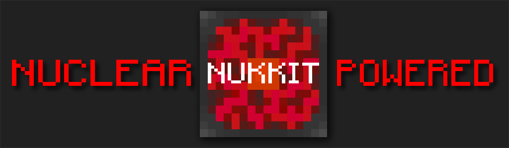

Nukkit
===================
__A Nuclear-Powered Server Software For Minecraft: Bedrock Edition__

**NOTICE: In it's current state, the project will not compile!**
-------------

### [License](LICENSE)

Introduction
-------------

Nukkit is nuclear-powered Server software for Minecraft: Bedrock Edition.
It has a few key advantages over other Server software:

* Written in Java, Nukkit is faster and more stable.
* Having a friendly structure, it's easy to contribute to Nukkit's development and rewrite plugins from other platforms into Nukkit plugins.

Nukkit is **undergoing improvement** yet, we welcome contributions. 

Example servers running Nukkit
--------------------
- **play.EaseCation.net**
- **play.GameTeam.cz**
- **MultiLabs.net**

Get Nukkit & Plugins
--------------------

#### Recommended Sites

* __[Official Site](https://nukkit.io)__
* __[Jar Download](https://ci.potestas.xyz/job/NukkitX)__
* __[Discussion](#discussion)__

*Thank you for visiting our official sites. Our official websites are provided free of charge, and we do not like to place ads on the home page affecting your reading. If you like this project, please [donate to us](https://www.paypal.com/cgi-bin/webscr?cmd=_donations&business=magicdroidx%40gmail%2ecom&lc=US&item_name=Nukkit&currency_code=USD&bn=PP%2dDonationsBF%3apaypal%2ddonate%2dyellow%2esvg%3aNonHostedGuest). All the donations will only be used for Nukkit websites and services.*

Build JAR file
-------------
- `git submodule update --init`
- `mvn clean package`

Running
-------------
Simply run `start.sh` or `start.cmd`, or execute `java -jar Nukkit.jar`.

Plugin API
-------------
#### **Example Plugin**
Example Plugin which shows the API of Nukkit.

* __[Example Plugin](http://github.com/Nukkit/ExamplePlugin)__

Development Tools
-----------------
There're some tools for Nukkit developers.

* __[FDevTools](https://github.com/fengberd/FDevTools)__ (**Load source and pack them easily**)
* __[PocketServer](https://github.com/fengberd/MinecraftPEServer)__ (**Run Nukkit on android devices**)

Contributing
------------
Please read the [CONTRIBUTING](.github/CONTRIBUTING.md) guide before submitting any issue. Issues with insufficient information or in the wrong format will be closed and will not be reviewed.

Discussion
-------------
* __[Forums](https://forums.nukkit.io)__
* __[百度 Nukkit 吧](http://tieba.baidu.com/f?kw=nukkit)__
